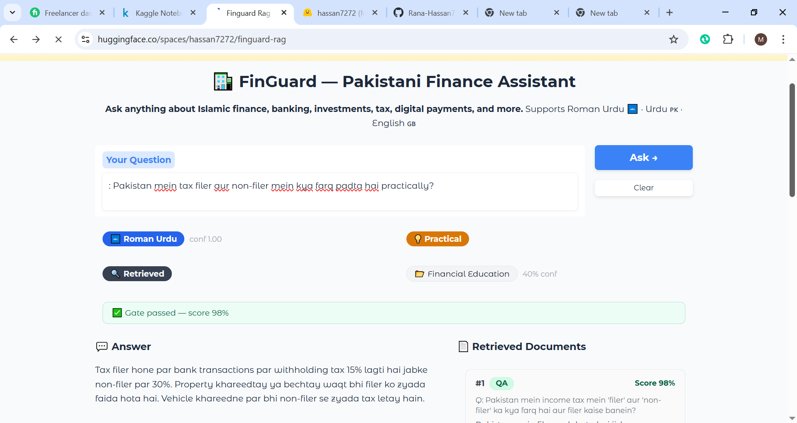

<div align="center">

# 🏦 FinGuard RAG

**Production-grade multilingual RAG system for Pakistani financial queries**

[](https://huggingface.co/spaces/hassan7272/finguard-rag)
[](https://huggingface.co/hassan7272/urdu-finance-embeddings)
[](https://huggingface.co/datasets/hassan7272/urdu-finance-qa)
[](https://www.python.org/)
[](LICENSE)

Roman Urdu 🔤 · Urdu 🇵🇰 · English 🇬🇧

</div>

---

## Overview

Most financial AI systems in Pakistan fail on three counts: they don't understand Roman Urdu, they can't handle domain-specific terminology like *zakat*, *riba*, or *murabaha*, and they hallucinate when they don't know the answer. FinGuard solves all three.

FinGuard is a production retrieval-augmented generation system built specifically for Pakistani financial queries. It combines a fine-tuned multilingual embedding model, hybrid BM25 + vector retrieval, cross-encoder reranking, a two-level semantic cache, and a confidence gate that hard-blocks LLM generation when retrieved context is insufficient. The system covers Islamic finance, conventional banking, digital payments (EasyPaisa, JazzCash), investments, tax filing, and remittances.

**Who this is for:** developers building Urdu-language finance assistants, researchers studying multilingual RAG, or anyone who wants a reproducible reference implementation of a production RAG pipeline with proper evaluation.

---

## Live Demo

**[→ Try it on HuggingFace Spaces](https://huggingface.co/spaces/hassan7272/finguard-rag)**

Ask in any language — Roman Urdu, Urdu script, or English:

```
zakat ka hisab kaise karein
زکوٰۃ کا نصاب کتنا ہے؟
how to file income tax return on FBR IRIS
easypaisa se paise kaise bhejein
```

### Demo screenshot

<p align="center">
  
</p>

<p align="center"><sub><strong>Figure:</strong> Live Space UI — Roman Urdu query, language/intent/category badges, confidence gate, LLM answer grounded in retrieved QA pairs, top‑3 reranked documents with scores, and end‑to‑end latency breakdown.</sub></p>

### Example interaction (Roman Urdu)

| Element | Sample |
|--------|--------|
| **Question** | `zakat kis pr farz ha` |
| **Detected** | Roman Urdu · Practical intent · Islamic finance |
| **Gate** | Passed (~87% reranker score on top chunk) |
| **Answer** | Explains zakat obligation on the *owner* of wealth (e.g. lender / recoverable loan), not the borrower — aligned with the top retrieved QA pair |
| **Retrieval** | Top‑3 QA snippets shown with cross‑encoder scores; answer stays within retrieved context |

---

## Architecture

```
User Query
    │
    ▼
Query Normalization          (lowercase, Urdu Unicode fix, Roman Urdu collapse)
    │
    ▼
Language Detection           (Urdu script / Roman Urdu / English)
    │
    ▼
Semantic Cache L1 ──────── HIT ──► Return cached answer ⚡  ~5ms
    │ MISS
    ▼
Semantic Cache L2 ──────── HIT ──► Skip retrieval ⚡  ~130ms
    │ MISS
    ▼
Category Detection           (keyword map → 8 domain categories)
    │
    ▼
Metadata Pre-filter          (restrict FAISS search space if confidence ≥ 0.65)
    │
    ▼
Query Intent Detection       (practical vs legal/policy)
    │
    ▼
Parallel Dual Retrieval
    ├── QA FAISS + BM25      (language-weighted RRF)
    └── PDF FAISS + BM25     (language-weighted RRF)
    │
    ▼
RRF Fusion                   (source-routing weights: QA 0.7 / PDF 0.3 practical)
    │
    ▼
MMR  top-20 → top-10         (diversity filter, λ=0.7)
    │
    ▼
Cross-Encoder Reranker       (BAAI/bge-reranker-base, top-10 → top-3)
    │
    ▼
Confidence Gate              (threshold 0.55 in config — hard block, no LLM call)
    │ PASS
    ▼
Prompt Builder               (QA template vs PDF/policy template)
    │
    ▼
LLM Generation               (Groq Llama‑3.3‑70B Versatile primary / OpenAI fallback)
    │                          (+ extractive QA fallback if API returns empty/error)
    ▼
Observability Logger         (JSONL per request)
    │
    ▼
Cache Store (L1 + L2)
    │
    ▼
Return Answer + Diagnostics
```

> For the full 12-phase build plan with design rationale, see [`plan.md`](plan.md).

---

## Evaluation Results

Evaluated on 158 held-out QA queries across 8 categories and 2 languages (Urdu + Roman Urdu).

### Ablation Table

| System Configuration | Acc@1 | Acc@3 | MRR |
|---|---|---|---|
| Baseline — BM25 only | 100.0% | 100.0% | 1.000 |
| + Fine-tuned embeddings | 99.4% | 100.0% | 0.997 |
| + Hybrid search (BM25 + Vector) | 100.0% | 100.0% | 1.000 |
| + MMR diversity filter | 100.0% | 100.0% | 1.000 |
| + Cross-encoder reranker | 98.1% | 100.0% | 0.991 |
| + Metadata pre-filter | 98.1% | 100.0% | 0.991 |
| **Full system (+ PDF dual-index)** | **100.0%** | **100.0%** | **1.000** |

The reranker slightly reduces Acc@1 because it reorders candidates — by design. Acc@3 remains 100% throughout, confirming the correct answer is always retrieved; reranking just changes surface position. The full dual-index system recovers to 100% Acc@1 because PDF chunks supplement QA context on boundary queries.

### Source Grounding (158 queries)

| Metric | Value |
|---|---|
| Gate pass rate | 100% |
| High-confidence answers (score > 0.70) | 100% |
| Answers QA-grounded | 100% |
| Gate block rate | 0% |

### Per-Category Gate Pass Rate

All 8 categories — digital finance, banking, financial education, Islamic finance, personal finance, investment, bills/payments, loans/credit — achieved 100% gate pass rate and 100% high-confidence rate.

### Latency Profile (100 queries, CPU)

| Stage | P50 | P95 | P99 |
|---|---|---|---|
| Query normalization | 20.8ms | 23.0ms | 23.6ms |
| Language detection | 0.06ms | 0.09ms | 0.14ms |
| Cache lookup | 0.33ms | 0.46ms | 0.54ms |
| Category detection | 0.20ms | 0.28ms | 0.32ms |
| Vector retrieval (QA) | 16.8ms | 19.2ms | 24.7ms |
| LLM generation (Groq) | ~3.5s mean | ~5.8s P95 | ~7.2s P99 |
| **Total end‑to‑end (cache miss)** | ~3.7s mean | ~5.8s P95 | ~5.9s P99 |

Numbers above are from a **100‑query profiler** run (retrieval + generation). **Hugging Face Spaces** cold starts add embedding/reranker model load time; first queries can show multi‑second retrieval until caches warm — warm CPU retrieval is typically tens–low‑hundreds of ms before reranker/LLM.

Cache hits (L1) skip retrieval and LLM. Language and category detection stay sub‑millisecond on warm paths.

---

## Features

- **Multilingual** — Roman Urdu, Urdu script, English in a single pipeline with per-language BM25/vector fusion weights
- **Dual corpus** — 1,510 curated QA pairs + 24 official Pakistani financial PDFs indexed separately to preserve BM25 scoring integrity
- **Fine-tuned embeddings** — `paraphrase-multilingual-mpnet-base-v2` fine-tuned with Multiple Negatives Ranking Loss and domain-aware hard negative mining; Acc@1 = 93.9%, MRR@10 = 0.966
- **Hybrid retrieval** — FAISS (IndexFlatIP) + BM25 (rank_bm25) fused via Reciprocal Rank Fusion with language-aware weights
- **MMR diversity** — Max Marginal Relevance at λ=0.7 prevents duplicate results in top-10
- **Cross-encoder reranking** — BAAI/bge-reranker-base scores all 10 candidates, selects top-3
- **Confidence gate** — Hard blocks LLM call when reranker top‑1 score is below config threshold (**default 0.55**); returns language‑appropriate fallback message
- **Extractive fallback** — If the LLM call fails or returns empty text after the gate passes, the pipeline can return the **top retrieved QA answer** so users still see grounded content
- **Two-level semantic cache** — L1 (answer cache, sim > 0.95) and L2 (retrieval cache, sim > 0.90) with corpus-version-based automatic invalidation and 48-hour TTL
- **Metadata pre-filtering** — 8-category keyword detector restricts FAISS search space before retrieval (applied when confidence ≥ 0.65)
- **Query intent routing** — Practical vs legal/policy detection adjusts QA/PDF source routing weights
- **Two prompt templates** — QA template vs PDF/policy template selected by doc_type of top-1 retrieved document; PDF template instructs citation
- **LLM with fallback** — Groq Llama-3.3-70B primary, OpenAI GPT-4o-mini fallback; exponential backoff, 10-second hard timeout
- **Structured observability** — JSONL log per request with language, intent, category, cache level, source mix, gate result, latency per stage
- **Full evaluation suite** — Ablation table, source grounding rates, per-language breakdown, P50/P95 latency profiler

---

## Repository Layout

```
finguard-rag/
│
├── app/
│   └── app.py                      # Gradio UI — for HF Space, copy this file to repo root as app.py
├── deployment/
│   ├── ensure_hf_artifacts.py      # Downloads missing retrieval/artifacts from HF_ARTIFACTS_DATASET
│   └── __init__.py
├── public/
│   └── images/
│       └── profile.png             # README / docs demo screenshot
├── docs/
│   └── HUGGINGFACE_SPACE_README.md # Paste-ready Space README (YAML + body)
├── plan.md                         # Full 12-phase architecture plan
├── requirements.txt
├── .env.example
│
├── retrieval/
│   ├── configs/
│   │   └── retrieval_config.yaml   # All thresholds, weights, paths, model IDs
│   ├── build_corpus.py             # QA dataset → deduped corpus.jsonl + docstore
│   ├── build_vector_index.py       # FAISS IndexFlatIP + versioned manifest
│   ├── build_bm25_index.py         # BM25Okapi token corpus + manifest
│   ├── build_pdf_vector_index.py   # FAISS index for PDF chunks
│   ├── build_pdf_bm25_index.py     # BM25 index for PDF chunks
│   ├── vector_retriever.py         # FAISS retriever + category pre-filter
│   ├── bm25_retriever.py           # BM25 retriever
│   ├── dual_retriever.py           # Parallel QA + PDF retrieval, source routing
│   ├── fusion.py                   # Weighted RRF fusion
│   ├── mmr.py                      # Max Marginal Relevance
│   ├── pipeline.py                 # End-to-end retrieval orchestrator
│   ├── language.py                 # Runtime language detector + fusion weight lookup
│   ├── normalization.py            # Query normalization (Roman Urdu, Urdu Unicode)
│   └── artifacts/                  # Built indexes (git-ignored, see Data & Artifacts)
│
├── ingestion/
│   ├── pdf_chunker.py              # LlamaIndex PDF load + chunk + section title prepend
│   ├── pdf_corpus_builder.py       # Chunks → canonical schema → JSONL
│   └── infer_category.py           # Category assignment for PDF chunks
│
├── metadata/
│   ├── category_detector.py        # Keyword-map category detector
│   └── filter_policy.py            # Filter confidence threshold policy
│
├── query/
│   ├── router.py                   # Intent detection (practical vs legal)
│   └── expander.py                 # Keyword expansion dictionary
│
├── cache/
│   ├── semantic_cache.py           # Two-level cosine-sim cache + TTL + version check
│   └── cache_stats.py              # Hit rate, latency saved, eviction tracking
│
├── generation/
│   ├── prompt_builder.py           # QA vs PDF template selection + context formatting
│   ├── llm_client.py               # Groq + OpenAI wrapper, retry, timeout
│   └── generator.py                # Gate → cache → prompt → LLM → store
│
├── observability/
│   ├── logger.py                   # JSONL request logger, daily rotation, thread-safe
│   └── analyzer.py                 # pandas analysis: cache, latency, gate, source mix
│
├── evaluation/
│   ├── full_eval.py                # Ablation table: Acc@1/3/10, MRR across all configs
│   ├── source_eval.py              # QA vs PDF grounding rates, per-category breakdown
│   └── latency_profiler.py         # P50/P95/P99 per stage across N queries
│
└── data/
    ├── documents/                  # PDF source files (git-ignored)
    └── corpus_schema.md            # Canonical document schema specification
```

---

## Requirements

```
Python 3.10+
CUDA optional (CPU works; GPU accelerates index build and reranker)
```

```bash
pip install -r requirements.txt
```

Key dependencies:

| Package | Role |
|---|---|
| `sentence-transformers` | Embedding model + cross-encoder reranker |
| `faiss-cpu` | Vector index (swap for `faiss-gpu` if CUDA available) |
| `rank-bm25` | BM25 keyword retrieval |
| `llama-index-core` | PDF ingestion only (not used for retrieval) |
| `llama-index-readers-file` | PDF file reader |
| `groq` | Primary LLM API |
| `openai` | Fallback LLM API |
| `gradio` | Demo UI |
| `pandas` | *(optional)* `pip install pandas` — required only for `observability/analyzer.py` |
| `pyyaml` | Config loading |
| `numpy` | Cosine similarity, vector ops |

> **CUDA note:** `faiss-cpu` works on all machines. For GPU-accelerated index build replace with `faiss-gpu` and ensure CUDA 11+ is installed. The reranker and embedding model automatically use GPU via `sentence-transformers` if available.

---

## Environment Variables

Copy `.env.example` to `.env` and fill in:

```bash
cp .env.example .env
```

```env
# Required — get free at https://console.groq.com
GROQ_API_KEY=gsk_...

# Optional — used as LLM fallback if Groq fails
OPENAI_API_KEY=sk-...

# Required for HuggingFace artifact download during Space bootstrap
HF_TOKEN=hf_...

# Artifact dataset for Space bootstrap (indexes too large for repo)
HF_ARTIFACTS_DATASET=hassan7272/finguard-artifacts
```

**HuggingFace Space secrets:** mirror the same four variables in your Space Settings → Secrets. The Space bootstrap script reads `HF_ARTIFACTS_DATASET` at startup to pull pre-built indexes so users don't wait for a cold build.

---

## Data & Artifacts

### QA Corpus
- **Dataset:** [`hassan7272/urdu-finance-qa`](https://huggingface.co/datasets/hassan7272/urdu-finance-qa) — 1,510 QA pairs across 8 categories in Roman Urdu, Urdu, and English
- **Built corpus:** `retrieval/artifacts/corpus.jsonl` and `retrieval/artifacts/docstore.json` (generated by `build_corpus.py`, not in git)

### PDF Corpus
- 24 Pakistani financial PDFs covering Islamic finance, banking regulation, digital payments, tax filing, investment guides
- Source files: `data/documents/` (not in git — add your own or download from the Space dataset)
- Built PDF corpus: `retrieval/artifacts/pdf_corpus.jsonl`

**LlamaIndex for PDFs — yes.** It is used **only at build time** in `ingestion/pdf_chunker.py`: `SimpleDirectoryReader` loads PDFs, `SentenceSplitter` chunks them; that output feeds `ingestion/pdf_corpus_builder.py`. **Runtime retrieval** is custom (FAISS + BM25 + fusion + rerank); LlamaIndex query engines are **not** used.

### Pre-built Indexes
All FAISS indexes, BM25 token corpora, and manifests live under `retrieval/artifacts/` and are git-ignored due to size. They are stored in the private HuggingFace dataset [`hassan7272/finguard-artifacts`](https://huggingface.co/datasets/hassan7272/finguard-artifacts) and downloaded automatically during Space startup.

To rebuild locally from scratch, follow the Build Pipeline section below.

---

## Build Pipeline

Run from the repo root. Each step writes versioned artifacts to `retrieval/artifacts/`.

**Step 1 — Build QA corpus**
```bash
python retrieval/build_corpus.py --source huggingface --dataset_id hassan7272/urdu-finance-qa
```

**Step 2 — Build QA vector index**
```bash
python retrieval/build_vector_index.py
```

**Step 3 — Build QA BM25 index**
```bash
python retrieval/build_bm25_index.py
```

**Step 4 — Ingest PDFs and build PDF corpus** *(skip if not using PDF corpus)*
```bash
python ingestion/pdf_corpus_builder.py --pdf_dir data/documents
```

**Step 5 — Build PDF vector index**
```bash
python retrieval/build_pdf_vector_index.py
```

**Step 6 — Build PDF BM25 index**
```bash
python retrieval/build_pdf_bm25_index.py
```

> **Index versioning rule:** if you retrain or update the embedding model, you must update `embedding_model.version_tag` in `retrieval/configs/retrieval_config.yaml` and rebuild all indexes. The system checks the manifest version at startup and refuses to serve if there is a mismatch.

---

## Running Locally

```bash
# From repo root (adds project root on sys.path automatically)
python app/app.py
```

The UI opens at `http://localhost:7860` (override with `PORT`). First run downloads embedding / reranker weights from HuggingFace (~minutes on slow networks).

**Artifacts:** ensure `retrieval/artifacts/` contains built indexes (see Build Pipeline) **or** set `HF_ARTIFACTS_DATASET` + `HF_TOKEN` so `deployment/ensure_hf_artifacts.py` can fetch them (same as Space).

**Smoke test a single query from the CLI:**
```bash
python -c "
from retrieval.pipeline import RetrievalPipeline
import yaml
cfg = yaml.safe_load(open('retrieval/configs/retrieval_config.yaml'))
p = RetrievalPipeline(cfg)
p.load()
out = p.run('zakat ka hisab kaise karein')
for doc in out.docs[:3]:
    print(doc.doc_id, doc.doc.get('question','')[:60])
"
```

---

## Evaluation

Outputs default to `evaluation/results/` (JSON + CSV).

**Full ablation table** (seven stacked configurations):
```bash
python evaluation/full_eval.py --test data/processed/splits/test.jsonl
```

**Source grounding** — gate rates, QA/PDF mix in top‑3, per-category breakdown:
```bash
python evaluation/source_eval.py --test data/processed/splits/test.jsonl
```

**Latency profiler** — P50–P99 per stage + LLM (needs `GROQ_API_KEY` for full path):
```bash
python evaluation/latency_profiler.py --test data/processed/splits/test.jsonl --n 100 --warmup 5
```

**Log analysis** — analyze live request logs after the system has served traffic:
```bash
python observability/analyzer.py
python observability/analyzer.py --section cache
python observability/analyzer.py --section latency
python observability/analyzer.py --tail 500
```

---

## Deploy to HuggingFace Space

Checklist:

- [ ] Create a **Gradio** Space; entry file **`app.py`** at repo root (sync from `app/app.py` in this repo).
- [ ] Include **`deployment/`**, **`retrieval/`** (code + configs), **`generation/`**, **`cache/`**, **`metadata/`**, **`query/`**, **`reranking/`**, **`observability/`**, plus **`requirements.txt`**.
- [ ] Do **not** commit large **`.index`** files — HF rejects raw binary blobs; store them in a HF **Dataset** (e.g. `hassan7272/finguard-artifacts`) with paths like `retrieval/artifacts/...`.
- [ ] Space **Secrets**: `GROQ_API_KEY`, `HF_TOKEN` (private dataset + Hub pulls), `HF_ARTIFACTS_DATASET`, optional `OPENAI_API_KEY` for LLM fallback.
- [ ] On startup, **`deployment/ensure_hf_artifacts.py`** runs inside **`app.py`** and downloads any missing artifact files before loading the pipeline.
- [ ] **`README.md`** on the Space should include YAML frontmatter (`sdk: gradio`, `app_file: app.py`). Paste-ready template: [`docs/HUGGINGFACE_SPACE_README.md`](docs/HUGGINGFACE_SPACE_README.md).

Hardware: **CPU Basic** works; GPU tier speeds up reranker/embedding if you upgrade.

---

## Citation

If you use FinGuard, the embedding model, or the dataset in your work:

```bibtex
@misc{finguard2025,
  author    = {Hassan},
  title     = {FinGuard RAG: Production Multilingual RAG for Pakistani Finance},
  year      = {2025},
  publisher = {HuggingFace},
  url       = {https://huggingface.co/spaces/hassan7272/finguard-rag}
}

@misc{urdufinanceembeddings2025,
  author    = {Hassan},
  title     = {urdu-finance-embeddings: Fine-tuned Multilingual Embeddings for Pakistani Finance},
  year      = {2025},
  publisher = {HuggingFace},
  url       = {https://huggingface.co/hassan7272/urdu-finance-embeddings}
}
```

**Third-party models and tools used:**

| Resource | License |
|---|---|
| [`BAAI/bge-reranker-base`](https://huggingface.co/BAAI/bge-reranker-base) | MIT |
| [`paraphrase-multilingual-mpnet-base-v2`](https://huggingface.co/sentence-transformers/paraphrase-multilingual-mpnet-base-v2) | Apache 2.0 |
| [Groq Llama-3.3-70B](https://console.groq.com) | Meta Llama 3 Community License |
| [FAISS](https://github.com/facebookresearch/faiss) | MIT |
| [rank-bm25](https://github.com/dorianbrown/rank_bm25) | Apache 2.0 |
| [LlamaIndex](https://github.com/run-llama/llama_index) | MIT |

---

## License

MIT — see [LICENSE](LICENSE).

---

<div align="center">
Built for Pakistan 🇵🇰 · Roman Urdu 🔤 · Urdu اردو · English
</div>